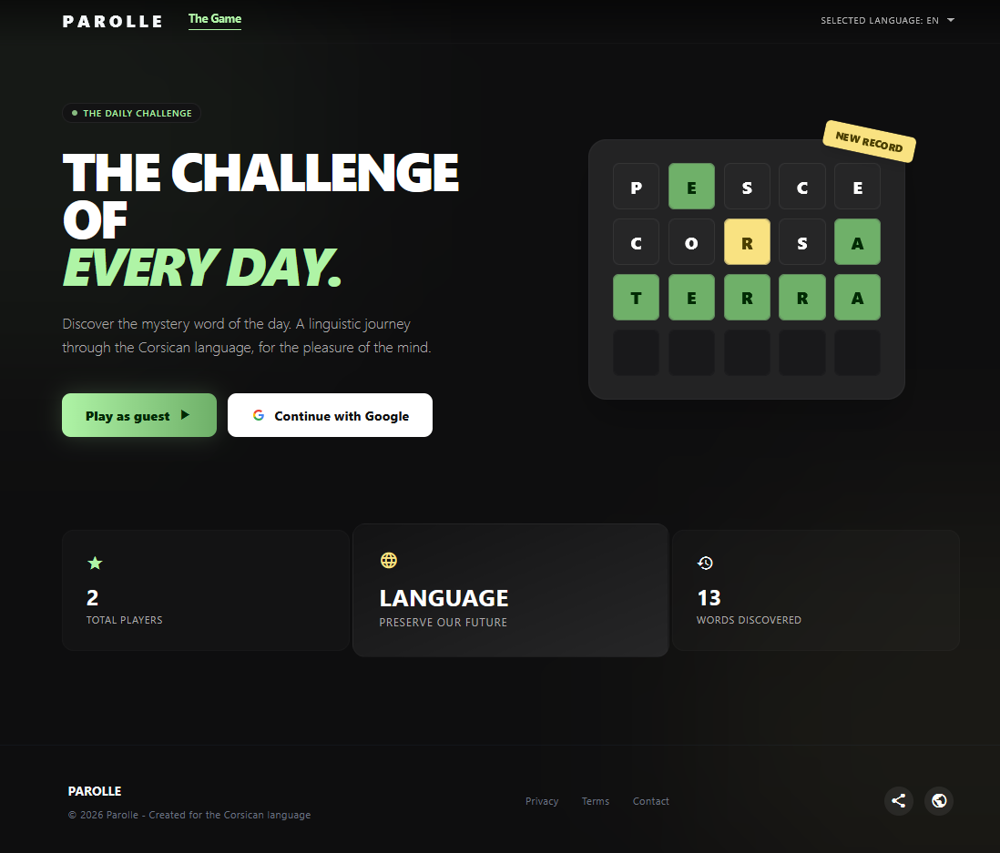
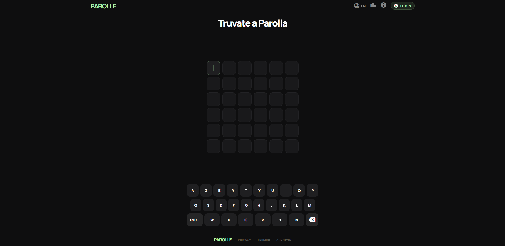
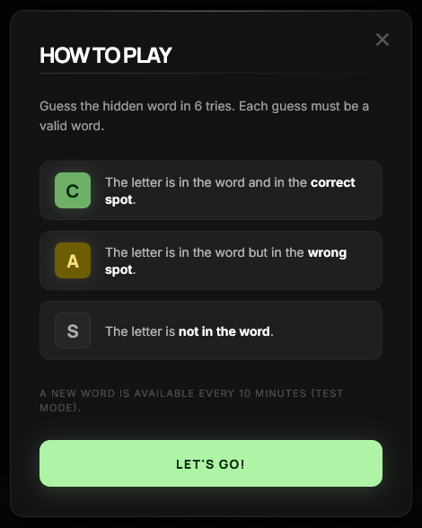
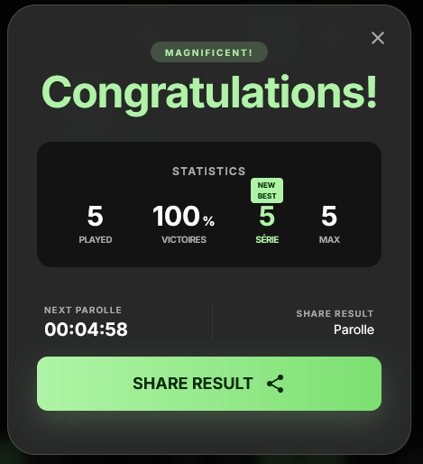
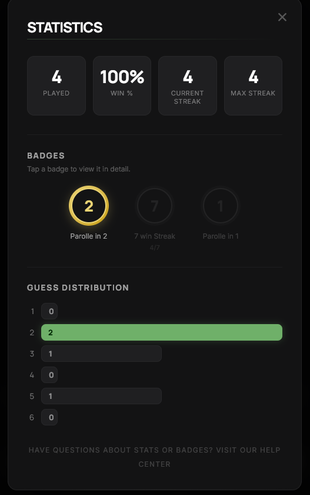
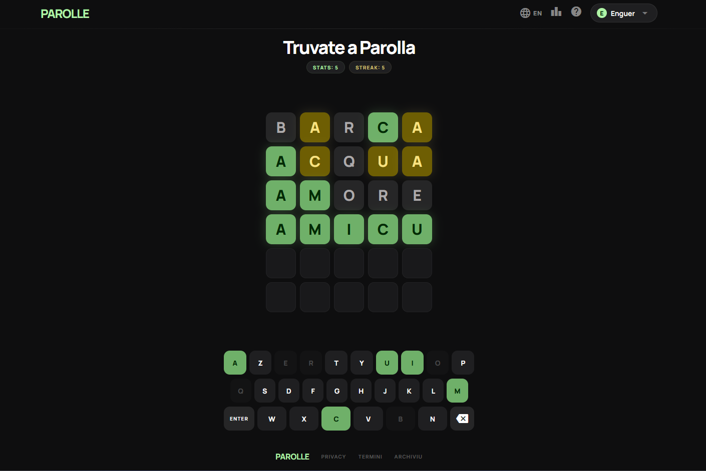

# 🟩 🟨 ⬜ Parolle - A Sfida di Ogni Ghjornu


🌍 **Live Demo:** [parolle-corsica.vercel.app](https://parolle-corsica.vercel.app)

---

### 📸 Aperçu / Preview

### 📸 Aperçu / Preview

<p align="center">
  <kbd>
    
  </kbd>
  <br>
</p>

<p align="center">
  
</p>

<p align="center">
  
</p>

<p align="center">
  
</p>

<p align="center">
  
</p>

<p align="center">
  
</p>

---
*(Scroll down for the English version 🇬🇧)*

## 🇫🇷 Français

**Parolle** est un jeu de lettres quotidien inspiré du célèbre "Wordle", spécialement conçu pour mettre en valeur et pratiquer la **langue corse**. Chaque jour, les joueurs ont 6 essais pour deviner un nouveau mot, tout en suivant leur progression mondiale.

### ✨ Fonctionnalités Principales
* **Gameplay Quotidien :** Un nouveau mot généré dynamiquement chaque jour via une fonction RPC PostgreSQL.
* **Authentification Sécurisée :** Connexion en un clic via Google OAuth pour sauvegarder sa progression.
* **Statistiques Avancées :** Suivi détaillé du pourcentage de victoires, des séries (streaks), de la distribution des essais et système de badges.
* **Design Responsive & Immersif :** Interface "Glassmorphism" conçue pour tenir sur un seul écran (sans scroll), avec des animations fluides (shake, flip).
* **Multilingue :** Interface traduisible dynamiquement (Corse, Français, Anglais, etc.).

### 💻 Stack Technique
* **Frontend :** Next.js (App Router), React, TypeScript.
* **Styling :** Tailwind CSS, Polices personnalisées (Manrope, Inter).
* **Backend & BDD :** Supabase (PostgreSQL, Authentication OAuth).
* **Déploiement :** Vercel.

---

## 🇬🇧 English

**Parolle** is a daily word puzzle game inspired by the famous "Wordle", specifically built to highlight and practice the **Corsican language**. Every day, players get 6 attempts to guess a new word while tracking their global progress.

### ✨ Key Features
* **Daily Gameplay:** A new word generated dynamically every day via a PostgreSQL RPC function.
* **Secure Authentication:** One-click login via Google OAuth to save user progress across devices.
* **Advanced Statistics:** Detailed tracking of win rates, streaks, guess distribution, and a custom badge system.
* **Responsive & Immersive UI:** "Glassmorphism" design strictly built to fit on a single screen (no scroll), featuring smooth animations.
* **Multilingual:** Dynamically translatable interface (Corsican, French, English, etc.).

### 💻 Tech Stack
* **Frontend:** Next.js (App Router), React, TypeScript.
* **Styling:** Tailwind CSS, Custom Fonts (Manrope, Inter).
* **Backend & DB:** Supabase (PostgreSQL, OAuth Authentication).
* **Deployment:** Vercel.

---

## ⚙️ Installation & Setup (Local Development)

Si vous souhaitez faire tourner le projet en local / *If you want to run the project locally*:

1. **Clone the repository:**
   ```bash
   git clone [https://github.com/Enguer2/parolle-corsica.git](https://github.com/Enguer2/parolle-corsica.git)
   cd parolle-corsica/parolle
   ```

2. **Install dependencies:**
    ```bash
    npm install
    ```
3.   **Set up environment variables:**
    Create a .env.local file in the root directory and add your Supabase credentials:

    ```bash
    NEXT_PUBLIC_SUPABASE_URL=your_supabase_url
    NEXT_PUBLIC_SUPABASE_ANON_KEY=your_supabase_anon_key
    ```

4. **Run the development server:**
    ```bash
    npm run dev
    ```

    Open http://localhost:3000 with your browser to see the result.

